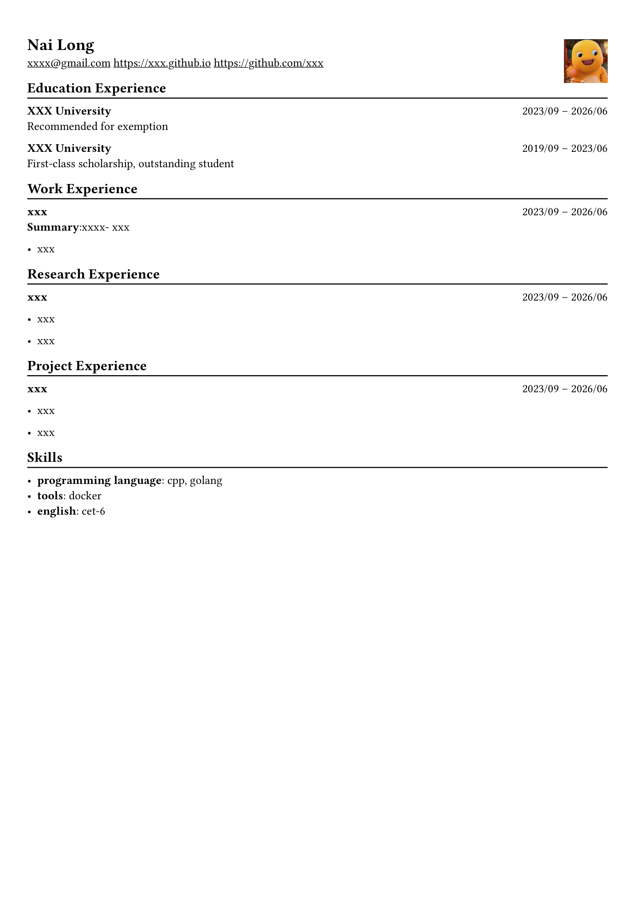

# CV-Generator

[English](readme.md) | 中文



## 概述

**CV-Generator** 是一个帮助你通过简单的 yaml 文件生成简历的工具，简单但实用，特别适合计算机专业的学生。

## 特点

- **简单的 YAML 配置：** 使用直观的 YAML 格式快速输入你的信息。

- **PDF 输出：** 生成随时可以分享或打印的高质量 PDF。

- **中英文支持：** 可以选择生成中文或英文简历。

## 开始使用

### 前置要求

Python 3.x

### 安装

1. 克隆仓库

```bash
git clone https://github.com/yourusername/cv-generator.git
cd cv-generator
```

2. 安装所需包

```bash
pip install -r requirements.txt
```

3. 用你的信息编辑 `cv.yaml` 文件。文件格式如下：

```yaml
metadata:
  version: chinese
name: 奶龙
email: xxxx@gmail.com
picture: "picture.jpeg"
github: https://github.com/xxx
homepage: https://xxx.github.io

education-experience:
  - name: XXX大学
    duration: 2023/09 -- 2026/06
    field: 网络空间安全
    award: 保研
  - name: XXX大学
    duration: 2019/09 -- 2023/06
    field: 软件工程
    award: 一等奖学金，优秀学生

work-experience:
  - name: xxx
    duration: 2023/09 -- 2026/06
    summary: xxxx
    details:
      - item: xxx
      - item: xxx

research-experience:
  - name: xxx
    price: nips
    duration: 2023/09 -- 2026/06
    details:
      - item: xxx
      - item: xxx

project-experience:
  - name: xxx
    price: xxx
    duration: 2023/09 -- 2026/06
    details:
      - item: xxx
      - item: xxx

skills:
  - name: 编程语言
    details: cpp, golang
  - name: 工具
    details: docker
  - name: 英语
    details: cet-6
```

你可以在 metadata 中将 `version` 字段改为 `english` 来生成英文简历。不需要的字段可以直接删除。

## 致谢

[Chi's cv](https://github.com/skyzh/chicv)